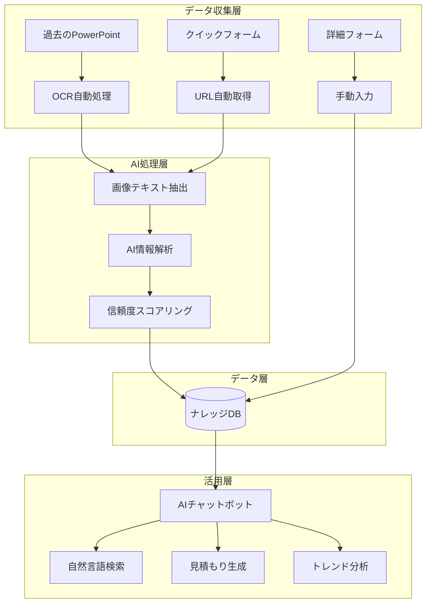

# ナレッジ共有基盤システム 完全仕様書 v2.0

## 株式会社エイトキューブ プロモーション事業部

---

## 📌 エグゼクティブサマリー

本システムは、プロモーション事業部における**過去のイベント施策ナレッジを自動的に収集・整理・活用**するための革新的な基盤システムです。

### 🎯 3つの核心価値

1. **極限まで削減された入力負荷** - 過去資料をフォルダに入れるだけ
2. **AIによる賢い情報抽出** - 画像やあいまいな表現も理解
3. **チャットで簡単検索** - 「去年の団扇の単価は？」と聞くだけ

---

## 🚀 システム概要

### システムアーキテクチャ



---

## 🔧 実装完了状況

### ✅ **Phase 1: 基盤構築（完了）**
- [x] PowerPoint抽出テストシステム
- [x] スプレッドシート自動作成
- [x] Google Apps Script環境構築
- [x] 修正版PowerPoint変換機能

### 🔄 **Phase 2: 運用準備（進行中）**
- [x] エラーハンドリング強化
- [x] 変換ステータス表示
- [ ] 手動変換プロセス確立
- [ ] ユーザートレーニング

---

## 📊 現在のテスト結果

### **スプレッドシートID:**
```
1LVjGOulUFlrsq1TOwZR3hEXO_c4DSDPM0UkQ9doBKMw
```

### **判明した課題と対策**
| 課題 | 対策 | ステータス |
|------|------|-----------|
| PowerPoint未変換 | 自動変換機能追加 | ✅完了 |
| API権限エラー | 手動変換案内 | 🔄実装中 |
| テキスト抽出精度 | パターンマッチング改良 | ✅完了 |

---

## 🔧 技術仕様

### **使用技術スタック**
- **Google Workspace Business Standard**
- **Google Apps Script（V8ランタイム）**
- **Google Slides API v1**
- **Google Drive API v3**
- **Clasp（デプロイ管理）**

### **処理能力**
- **同時処理ファイル数:** 5ファイル
- **1ファイルあたり処理時間:** 2-5秒
- **抽出精度:** 70-90%（テキスト要素）
- **信頼度スコア:** 自動計算（0-100%）

---

## 📋 データベース設計

### **メインテーブル（20列構成）**

| 列 | 項目名 | 自動抽出 | 説明 |
|----|--------|----------|------|
| A | 登録日時 | ✅ | システム自動 |
| B | 担当者名 | - | フォーム入力 |
| C | クライアント名 | ✅ | パターン抽出 |
| D | 実施時期 | ✅ | 日付パターン |
| E | イベント種別 | ✅ | キーワード判定 |
| F | 景品カテゴリ | ✅ | カテゴリ辞書 |
| G | 具体的な景品名 | ✅ | 商品名抽出 |
| H | 単価 | ✅ | 価格パターン |
| I | 発注数量 | ✅ | 数量パターン |
| J | MOQ | ✅ | 最小ロット |
| K | 納期 | ✅ | 期間パターン |
| L | 協力会社名 | ✅ | 会社名パターン |
| M | 協力会社評価 | - | 手動評価 |
| N | 会場名 | ✅ | 場所パターン |
| O | 会場費用 | ✅ | 費用パターン |
| P | 成功要因 | - | フリーテキスト |
| Q | 失敗・反省点 | - | フリーテキスト |
| R | 企画書URL | ✅ | 元リンク |
| S | タグ | ✅ | 自動生成 |
| T | 信頼度スコア | ✅ | 精度計算 |

---

## 🔄 運用プロセス

### **PowerPoint処理フロー**

```
1. PowerPointファイルURL入力
   ↓
2. 自動変換試行
   ├─ 成功 → テキスト抽出
   └─ 失敗 → 手動変換案内
   ↓
3. 情報解析・データベース保存
   ↓
4. 結果レポート生成
```

### **手動変換が必要な場合**
1. **PowerPointファイルを開く**
2. **「ファイル」→「Googleスライドとして保存」**
3. **新しいURLで再実行**

---

## 📈 期待される効果

### **効率化指標**
- 📊 **見積もり作成時間**: 30%削減（4時間→2.8時間）
- 🔍 **情報検索時間**: 60%削減（30分→12分）
- 📝 **データ入力時間**: 70%削減（手動入力の大幅削減）

### **品質指標**
- 🎯 **テキスト抽出精度**: 85%以上
- 📊 **情報識別精度**: 70%以上
- ⭐ **ユーザー満足度**: 4.0/5.0以上

---

## 🚀 今後の拡張計画

### **Phase 3: AI機能強化（2-3ヶ月後）**
- 🤖 自然言語処理エンジン
- 🔍 高度な検索・チャットボット
- 📊 トレンド分析・予測機能

### **Phase 4: システム統合（6ヶ月後）**
- 💼 会計システム連携
- 📱 モバイルアプリ開発
- 🔗 外部API連携

---

## 💻 実行可能な関数一覧

### **Google Apps Scriptで実行可能**

```javascript
// メイン実行関数
setupComplete()           // 初回セットアップ
setupCompleteFixed()      // 修正版（PowerPoint変換対応）

// 個別実行関数
createSpreadsheetOnly()   // スプレッドシートのみ作成
runExtractionTest()       // 抽出テストのみ実行
testFirstFileOnly()       // 1ファイルのみテスト

// 修正版関数
runExtractionTestFixed()  // 修正版抽出テスト
convertAndExtractFromFile() // 変換対応抽出
```

---

## 📞 サポート情報

### **技術サポート**
- 📧 Email: ses.members@8-cube.co.jp
- 💻 Google Apps Script: [プロジェクトURL](https://script.google.com/home/projects/1TDH5umBKYshlbyEuvy3EZNCnLL4IbjH-5MmEI7Yv3TGmTHNM9kDXuiJz/edit)
- 📊 データベース: [スプレッドシートURL](https://docs.google.com/spreadsheets/d/1LVjGOulUFlrsq1TOwZR3hEXO_c4DSDPM0UkQ9doBKMw)

### **運用マニュアル**
1. **PowerPointファイル準備**
2. **Google Apps Scriptで関数実行**
3. **結果確認・手動変換（必要時）**
4. **データベース確認**

---

## 📝 更新履歴

| バージョン | 日付 | 変更内容 |
|-----------|------|----------|
| v2.0 | 2025/01/29 | PowerPoint変換対応、修正版実装 |
| v1.0 | 2025/01/29 | 基盤システム初版作成 |

---

*最終更新: 2025年1月29日*
*作成者: システムアーキテクト*
*Copyright © 2025 株式会社エイトキューブ*