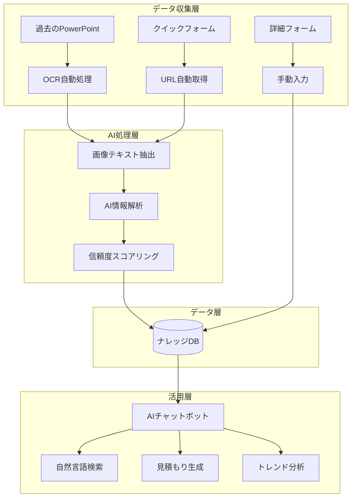

# ナレッジ共有基盤システム 完全仕様書 v2.0

## 株式会社エイトキューブ プロモーション事業部

---

## 📌 エグゼクティブサマリー

本システムは、プロモーション事業部における**過去のイベント施策ナレッジを自動的に収集・整理・活用**するための革新的な基盤システムです。

### 🎯 3つの核心価値

1. **極限まで削減された入力負荷** - 過去資料をフォルダに入れるだけ
2. **AIによる賢い情報抽出** - 画像やあいまいな表現も理解
3. **チャットで簡単検索** - 「去年の団扇の単価は？」と聞くだけ

---

## 🚀 システム概要

### システムアーキテクチャ



---

## 🔧 機能詳細

### 1. OCR強化機能 - 過去資料の自動取り込み

#### 1.1 基本仕様

| 項目 | 内容 |
|------|------|
| 処理能力 | 1回100ファイルまで、1ファイル約30秒 |
| 対応形式 | PowerPoint、PDF、画像ファイル |
| 実行頻度 | 1時間ごとの自動実行 |
| エラー処理 | 自動リトライ3回、失敗時はログ記録 |

#### 1.2 OCR処理対象

- ✅ テキストボックス内の文字
- ✅ **画像に埋め込まれた文字**
- ✅ **表（テーブル）のデータ**
- ✅ **グラフの数値とラベル**
- ✅ **手書きメモ**（認識可能な範囲）
- ✅ **価格表の写真**
- ✅ **名刺・ロゴ画像**

#### 1.3 処理フロー

```
1. 未処理フォルダをスキャン
   ↓
2. PowerPointをGoogleスライドに変換
   ↓
3. 各スライドの画像を抽出
   ↓
4. Google Cloud Vision APIでOCR処理
   ↓
5. AI処理で情報を構造化
   ↓
6. データベースに自動登録
   ↓
7. 処理済みフォルダに移動
```

---

### 2. AI情報抽出エンジン

#### 2.1 自然言語理解

##### 従来の抽出方法（正規表現）
```javascript
// 固定パターンのみ
/単価[：:]\s*(\d+)円/
```

##### 新AI抽出（自然言語対応）

| 入力テキスト | AI抽出結果 |
|------------|-----------|
| 「ワンコイン程度で調達可能」 | 単価: 500円 |
| 「去年より2割アップ」 | 前年比: +20% |
| 「A社は良いが納期が厳しい」 | A社: 品質◯、納期△ |
| 「即納可能」 | 納期: 即日 |
| 「大量発注で単価3割減」 | 数量割引: 30% |

#### 2.2 信頼度スコアリング

```python
信頼度スコア（0-100%）の基準：
- 90-100%: 明確な数値記載「単価：500円」
- 70-89%:  推定可能「約500円程度」
- 50-69%:  文脈から推測「ワンコイン」
- 30-49%:  曖昧な表現「安価」
- 0-29%:   推測困難
```

#### 2.3 賢いタグ自動生成

```javascript
// 入力テキストから自動的にタグを生成
テキスト: "2024年夏のビーチイベントで配布したエコバッグ"
         ↓
自動生成タグ: [#夏季, #ビーチ, #エコ, #環境配慮, #2024年]
```

---

### 3. AIチャットボット

#### 3.1 対話例

##### 🔍 **検索クエリ**
```
👤 ユーザー: 去年の夏に使った団扇の情報を教えて

🤖 AI: 2024年夏のキャンペーンで使用した団扇の情報です：

📦 商品情報
- 商品名: オリジナル団扇（両面フルカラー）
- 単価: 85円/枚
- 発注数: 5,000枚
- 総額: 425,000円

🏢 協力会社
- 会社名: 〇〇印刷株式会社
- 評価: ★★★★☆（納期◎、品質○）
- 納期: 14営業日

💡 成功ポイント
- デザインが好評で配布率95%
- SNSでの拡散効果あり
```

##### 💰 **見積もり支援**
```
👤 ユーザー: 予算50万円で1000人規模のイベント景品を提案して

🤖 AI: 過去の類似案件から最適な組み合わせを提案します：

🎁 推奨構成（予算内）
1. メイン景品（抽選10名）
   - タブレット端末 @25,000円 × 10 = 250,000円

2. 参加賞（全員配布）
   - エコバッグ @150円 × 1000 = 150,000円

3. アンケート回答特典（500名想定）
   - ボールペン @180円 × 500 = 90,000円

💵 合計: 490,000円（予算内）

📊 類似実績: 2024年3月〇〇社イベント（満足度92%）
```

##### 📊 **トレンド分析**
```
👤 ユーザー: 最近人気の景品トレンドを教えて

🤖 AI: 直近3ヶ月の人気景品ランキング：

🏆 TOP 5
1. 🥇 モバイルバッテリー（シェア23%）
2. 🥈 エコバッグ（シェア18%）
3. 🥉 ステンレスタンブラー（シェア15%）
4. 4️⃣ ワイヤレスイヤホン（シェア12%）
5. 5️⃣ 除菌グッズ（シェア10%）

📈 トレンド
- エコ・SDGs関連が40%増加
- デジタルガジェット系が安定人気
- 単価は500-1500円帯が主流
```

---

## 📊 データベース設計

### メインテーブル構造（拡張版）

| 列 | 項目名 | データ型 | 説明 | 自動抽出 |
|----|--------|----------|------|----------|
| A | 登録日時 | DateTime | タイムスタンプ | ✅ |
| B | 担当者名 | String | 記入者 | - |
| C | クライアント名 | String | 顧客名 | ✅ |
| D | 実施時期 | String | イベント時期 | ✅ |
| E | イベント種別 | String | カテゴリ | ✅ |
| F | 景品カテゴリ | String | 分類 | ✅ |
| G | 具体的な景品名 | String | 商品名 | ✅ |
| H | 単価 | Number | 円 | ✅ |
| I | 発注数量 | Number | 個数 | ✅ |
| J | MOQ | Number | 最小ロット | ✅ |
| K | 納期 | String | 期間 | ✅ |
| L | 協力会社名 | String | 業者 | ✅ |
| M | 協力会社評価 | Number | 1-5 | - |
| N | 会場名 | String | 場所 | ✅ |
| O | 会場費用 | Number | 円 | ✅ |
| P | 成功要因 | Text | フリーテキスト | - |
| Q | 失敗・反省点 | Text | フリーテキスト | - |
| R | 企画書URL | URL | リンク | ✅ |
| S | タグ | String | カンマ区切り | ✅ |
| T | 入力方式 | String | 手動/自動 | ✅ |
| U | OCR処理済 | Boolean | フラグ | ✅ |
| V | 信頼度スコア | Number | 0-100 | ✅ |
| W | 元ファイル名 | String | ソース | ✅ |
| X | AI処理日時 | DateTime | 処理時刻 | ✅ |
| Y | カテゴリタグ | String | AI分類 | ✅ |
| Z | 類似案件ID | String | 関連ID | ✅ |
| AA | 特記事項 | Text | AI抽出 | ✅ |
| AB | 画像URL | URL | 関連画像 | ✅ |

---

## 🔄 実装ロードマップ

### Phase 1: 基盤構築（第1-2週）
- [x] 既存システムの改良
- [x] OCR基本機能の実装
- [x] バッチ処理システム構築
- [ ] Google Cloud Vision API連携

### Phase 2: AI強化（第3-4週）
- [ ] OpenAI API統合
- [ ] 自然言語処理エンジン実装
- [ ] 信頼度スコアリング機能
- [ ] スマートタグ生成

### Phase 3: チャットボット（第5-6週）
- [ ] 対話エンジン開発
- [ ] Googleチャット連携
- [ ] Slack連携
- [ ] Web UI開発

### Phase 4: 運用最適化（第7-8週）
- [ ] パフォーマンスチューニング
- [ ] エラーハンドリング強化
- [ ] ユーザートレーニング
- [ ] 本番環境移行

---

## 💻 技術仕様

### 必要なAPI・サービス

#### Google Cloud Platform
```javascript
// 必須
- Google Workspace API
- Google Apps Script
- Google Drive API
- Google Slides API

// 推奨
- Cloud Vision API（OCR処理）
- Natural Language API（自然言語処理）
- Vertex AI（機械学習）
```

#### 外部サービス（オプション）
```javascript
// 高度なAI処理
- OpenAI API (GPT-4)
- Anthropic Claude API

// コミュニケーション
- Slack API
- Microsoft Teams API
```

### システム要件

| 項目 | 最小要件 | 推奨要件 |
|------|---------|----------|
| Google Workspace | Business Starter | Business Standard |
| ストレージ | 30GB | 100GB+ |
| API割り当て | 標準 | 拡張 |
| 同時ユーザー数 | 10 | 50+ |

---

## 📈 KPI・成功指標

### 効率化指標
- 📊 **見積もり作成時間**: 50%削減（4時間→2時間）
- 🔍 **情報検索時間**: 80%削減（30分→6分）
- 📝 **データ入力時間**: 90%削減（手動→自動）

### 活用度指標
- 💬 **チャット利用回数**: 月500回以上
- 📁 **登録データ数**: 月100件以上
- 🔄 **データ再利用率**: 40%以上

### 品質指標
- 🎯 **OCR認識精度**: 85%以上
- 🤖 **AI抽出精度**: 80%以上
- ⭐ **ユーザー満足度**: 4.0/5.0以上

---

## 🔒 セキュリティ・コンプライアンス

### データ保護
- 🔐 個人情報の自動マスキング
- 🔑 役職別アクセス権限
- 📝 監査ログの完全記録
- 💾 日次自動バックアップ

### プライバシー対応
- GDPR/個人情報保護法準拠
- クライアント情報の暗号化
- データ保持期限の自動管理

---

## 🚀 今後の拡張計画

### 2025年 Q2-Q3
- 📱 **モバイルアプリ開発**
  - スマホ撮影→即DB登録
  - 外出先での検索機能

### 2025年 Q4
- 🤖 **予測AI実装**
  - 価格変動予測
  - トレンド予測
  - 需要予測

### 2026年
- 🔗 **外部システム連携**
  - 会計システム
  - 在庫管理システム
  - CRM連携

---

## 📞 サポート情報

### 運用サポート
- 📧 メール: knowledge-support@8cube.co.jp
- 💬 Slack: #knowledge-support
- 📱 内線: 1234

### ドキュメント
- 📖 [ユーザーマニュアル](./user-manual.md)
- 🔧 [管理者ガイド](./admin-guide.md)
- 🐛 [トラブルシューティング](./troubleshooting.md)

---

## 📝 更新履歴

| バージョン | 日付 | 変更内容 |
|-----------|------|----------|
| v2.0 | 2025/01/29 | OCR機能、AI抽出、チャットボット追加 |
| v1.0 | 2025/01/29 | 初版作成 |

---

*最終更新: 2025年1月29日*
*作成者: システムアーキテクト*
*Copyright © 2025 株式会社エイトキューブ*